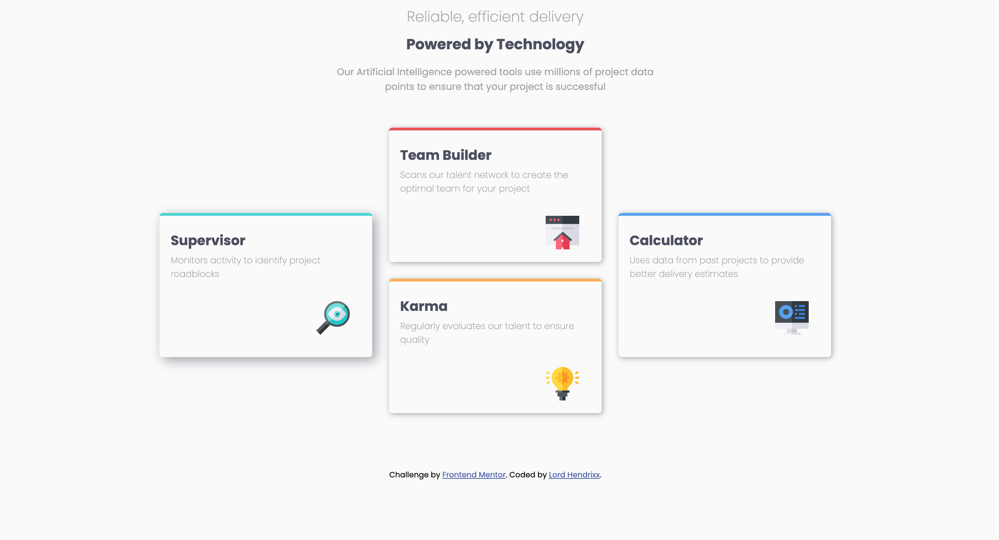

# Frontend Mentor - Four card feature section solution

This is a solution to the [Four card feature section challenge on Frontend Mentor](https://www.frontendmentor.io/challenges/four-card-feature-section-weK1eFYK). Frontend Mentor challenges help you improve your coding skills by building realistic projects. 

## Table of contents

- [Overview](#overview)
  - [The challenge](#the-challenge)
  - [Screenshot](#screenshot)
  - [Links](#links)
- [My process](#my-process)
  - [Built with](#built-with)
  - [What I learned](#what-i-learned)
  - [Continued development](#continued-development)
  - [Useful resources](#useful-resources)
- [Author](#author)
- [Acknowledgments](#acknowledgments)

## Overview

### The challenge

Users should be able to:

- View the optimal layout for the site depending on their device's screen size

### Screenshot

### Links

- Solution URL: [Vercel](https://four-card-feature-project-nine.vercel.app/)

## My process

### Built with

- Semantic HTML5 markup
- CSS custom properties
- Flexbox
- CSS Grid
- Mobile-first workflow

### What I learned
- The difference between CSS Grid and Flex-box.
- Proper application of grid and responsive web design.

### Continued development
- I hope get into the intricacies of CSS Grid and responsive web design.

### Useful resources

- [Josh Comeau](https://www.joshwcomeau.com/css/interactive-guide-to-grid/) - This article really helped me understand the basics of CSS Grid and Flexbox.

## Author

- Twitter - [@Maduakonam Moses](https://www.twitter.com/Maduakonam67451)

- Frontend Mentor - [@yourusername](https://www.frontendmentor.io/profile/beeAlmighty)

## Acknowledgments

- I would like to thank [Josh Comeau](https://www.joshwcomeau.com/css/interactive-guide-to-grid/) for his extensive CSS Grid article.
- Also appreciate WebDevSimplified for his youtube tutorials on how to tackle this project.
